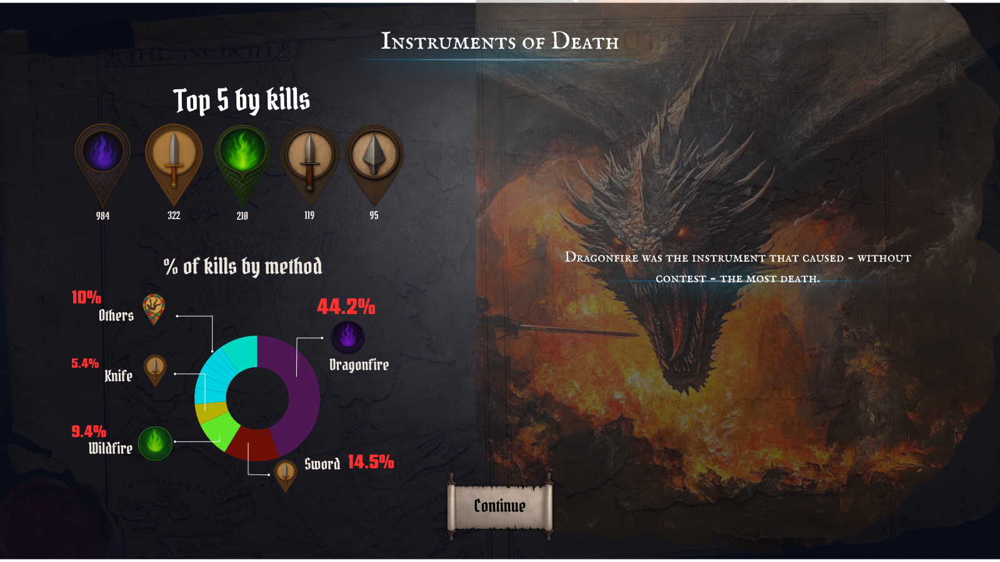

# 🐉 The Game of Thrones Death Ledger

> **Explore the Lore.** Who killed who? Where, how, and why?  
> A custom, interactive dashboard for fans and freaks.

[](https://shorturl.at/DVd2U)

---

## 🛡️ Project Origin

This was my **first-ever Tableau project**, created as part of a data visualization course.  
What started as a simple assignment quickly spiraled into a full-blown creative obsession—with custom icons, character art, lore expansion, and a cinematic dashboard experience.

---

## 📊 Dashboard Overview

A visual chronicle of Westeros’ deadliest tales.  
This Tableau dashboard analyzes *Game of Thrones* deaths by character, location, house, and method—layered with original imagery and fan-sourced data.

📍 **Live Preview**: [View on Tableau Public](https://shorturl.at/DVd2U) *(Note: not final version)*

---

## 🔧 Built With

- **Google Sheets** — for organizing and extending data
- **SQL** — for quick custom datasets and analysis 
- **ChatGPT & Midjourney** — for AI-assisted image generation and lore writing  
- **Tableau** — for dashboard design and interactivity  
- **GitHub Desktop** — for version control and hosting  

---

## 📁 Project Structure

```bash 
got-tableau-dashboard/
├── data/
│   ├── data_cleaning.md              # Documentation of the data cleaning process
│   ├── got_characters.csv            # Character metadata
│   ├── got_clean_sheet.csv           # character metadata (no kills and still alive)
│   ├── got_kills.csv                 # Kill records and relationships
│   ├── got_locations.csv             # Location metadata and coordinates
│
├── images/
│   ├── characters/                   # Character portraits (1024x1536 PNGs)
│   ├── house/                        # House sigils and shields (1024x1024 PNGs)
│   ├── location/                     # Location artwork (widescreen format)
│   ├── method/                       # Icons representing kill methods (1024x1024 PNGs)
│
├── sql_scripts/
│   ├── 01_kill_count_per_character.sql   # Total kills per killer
│   ├── 02_kills_per_location.sql         # Kills grouped by location
│   ├── 03_method_rank.sql                # Ranked list of kill methods
│   ├── 04_kill_path_by_character.sql     # Path of each killer across episodes
│   ├── 05_kill_path_Arya_Stark.sql       # Arya Stark’s specific journey
│   ├── README.md                         # Description of SQL queries
│
├── .gitattributes
├── .gitkeep
├── README.md                            # Project overview, usage, and credits

```


---

## 🧙 Data Sources

- Based on public GoT datasets from [Dataworld](https://data.world/makeovermonday/2019w27) by @vizwiz  
- Expanded with self-collected data from fan wikis and lore research

---

## 🎨 Visual Assets

All visuals were custom-generated using AI tools like **Midjourney** and **ChatGPT's image tools**, then categorized for use within Tableau’s custom shape folders.

---

## ✍️ Created By

**Ross Anderson**  
🐦 [@RA_DataViz](https://x.com/RA_DataViz)

---

## 🧠 Conclusion

**What I learned:**
- Tableau isn’t built for storytelling — but with creativity, you can stretch it.
- Built dynamic views with linked filters, image swapping, and calculated logic.
- Struggled with things like resets, layout control, and filter formatting.
- Learned to work around Tableau’s quirks.

Far from perfect, but a huge step forward in data-management, design thinking, problem solving, and my understanding of working in Tableau, SQL, Github and various AI's.


---

## 📜 License

This project is for educational and portfolio use only.  
Custom visuals are not licensed for commercial use without permission.

---

## ⚔️ Acknowledgment

All names, places, events, and imagery are inspired by the world of *A Song of Ice and Fire*, created by **George R. R. Martin**.

This is a non-commercial, fan-made visualization.  
All intellectual property belongs to **George R. R. Martin** and affiliated rights holders, including **HBO**.
